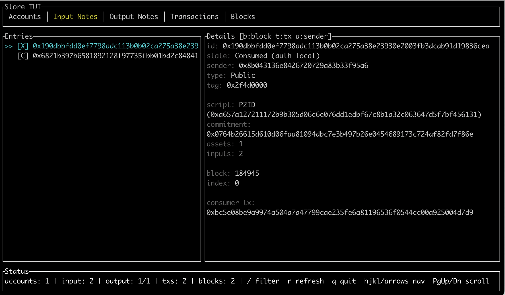

# Teasel

Lightweight CLI utilities for inspecting Miden files, local stores, and RPC endpoints.

## Installation

```bash
# From source
cargo install teasel

# Or from source
git clone https://github.com/igamigo/teasel.git
cd teasel
make install
```

## Configuration

Teasel automatically reads `miden-client` configuration if present:
- `.miden/miden-client.toml` (local directory)
- `~/.miden/miden-client.toml` (global)

When a config is found, store path and RPC endpoint are used as defaults. You can override them with `--store` and `--network`/`--endpoint` flags.

## Usage

### Inspect Files

Inspect serialized note or account files:

```bash
teasel inspect <path-to-note-or-account-file>
teasel inspect <path> --validate --network devnet
```

| Flag | Description |
|------|-------------|
| `--validate` | Validate against a node. For notes: checks inclusion proof and nullifier status. For accounts: checks on-chain existence, state comparison, and staleness detection. |

<details>
<summary><strong>Example: Inspect a Note File with Validation</strong></summary>

```bash
# First, fetch and save a note from devnet
teasel rpc note 0x0e18ee4177e7c6b32d19e9a81200cb86a7afd50828a1c5384ffd2b8fc41e167e --network devnet --save note.mno

# Then inspect with validation
teasel inspect note.mno --validate --network devnet
```

Output:
```
Saved NoteFile to note.mno
Note 0x0e18ee4177e7c6b32d19e9a81200cb86a7afd50828a1c5384ffd2b8fc41e167e:
- sender: 0x8b043136e8426720729a83b33f95a6
- type: Public
- tag: 0x3e800000
- included in block: 273675
- node index in block: 0
- assets: 1
- asset details:
  [0] fungible amount=1000000 faucet=0x8b043136e8426720729a83b33f95a6
- script root: 0xa657a127211172b9b305d06c6e076dd1edbf67c8b1a32c063647d5f7bf456131 (P2ID)
- inputs (P2ID):
  target account: 0xfa0000000000bb800000cc000000de
Inspecting note.mno as NoteFile
- variant: NoteWithProof
- note id: 0x0e18ee4177e7c6b32d19e9a81200cb86a7afd50828a1c5384ffd2b8fc41e167e
- sender: 0x8b043136e8426720729a83b33f95a6
- type: Public
- tag: 0x3e800000
- assets: 1
- asset details:
  [0] fungible amount=1000000 faucet=0x8b043136e8426720729a83b33f95a6
- script root: 0xa657a127211172b9b305d06c6e076dd1edbf67c8b1a32c063647d5f7bf456131 (P2ID)
- created in block: 273675
- node index in block: 0
- inputs (P2ID):
  target account: 0xfa0000000000bb800000cc000000de

Validation (network: https://rpc.devnet.miden.io):
- validation path: local inclusion proof (block header check)
- local inclusion proof: ok (index 0)
- nullifier 0xa2d4a93f342f2d215ef16fb24e4696d06ac250abfb8c13e2e607523ca2188575 not found (unspent or not yet known)
```

</details>

### RPC Commands

Query Miden nodes directly:

```bash
teasel rpc status --network devnet
teasel rpc block <block-num> --network devnet
teasel rpc note <note-id> --network devnet
teasel rpc account <address-or-account-id> --verbose --network devnet
```

| Flag | Description |
|------|-------------|
| `--verbose` | Show detailed output (e.g., full account vault contents) |
| `--save <path>` | Save fetched note to a file (for `rpc note` command) |

<details>
<summary><strong>Devnet Examples</strong></summary>

```bash
# Check devnet status and latest block
teasel rpc status --network devnet

# Query the native asset faucet account
teasel rpc account 0xd0da1f806b49552007c49c95d519d7 --network devnet

# Get block details
teasel rpc block 273518 --network devnet

# Fetch a note by ID
teasel rpc note 0x0e18ee4177e7c6b32d19e9a81200cb86a7afd50828a1c5384ffd2b8fc41e167e --network devnet

# Fetch and save a note to a file
teasel rpc note 0x0e18ee4177e7c6b32d19e9a81200cb86a7afd50828a1c5384ffd2b8fc41e167e --network devnet --save note.mno
```

Example output for note query:
```
Note 0x0e18ee4177e7c6b32d19e9a81200cb86a7afd50828a1c5384ffd2b8fc41e167e:
- sender: 0x8b043136e8426720729a83b33f95a6
- type: Public
- tag: 0x3e800000
- included in block: 273675
- node index in block: 0
- assets: 1
- asset details:
  [0] fungible amount=1000000 faucet=0x8b043136e8426720729a83b33f95a6
- script root: 0xa657a127211172b9b305d06c6e076dd1edbf67c8b1a32c063647d5f7bf456131 (P2ID)
- inputs (P2ID):
  target account: 0xfa0000000000bb800000cc000000de
```

</details>

### Store Commands

Inspect local miden-client sqlite stores:



```bash
teasel store path                                    # Print default store path
teasel store info                                    # Print store summary
teasel store account list                            # List tracked accounts
teasel store account get --account <address-or-id>   # Get account details
teasel store note list                               # List notes
teasel store note get <note-id>                      # Get note details
teasel store tag list                                # List tracked note tags
teasel store tx list                                 # List transactions
teasel store tx inspect <tx-id> --verbose            # Inspect transaction
teasel store tui                                     # Interactive store browser
```

| Flag | Description |
|------|-------------|
| `--store <path>` | Use a custom store path instead of the default |
| `--verbose` | Show detailed transaction info (for `tx inspect`) |

### Parsing Helpers

Parse and convert common Miden formats:

```bash
teasel parse word <felt1> <felt2> <felt3> <felt4>    # Build word from felts
teasel parse account-id <address-or-id>              # Parse account ID
teasel parse address <bech32-or-id> --network testnet
teasel parse note-tag <tag>                          # Parse note tag
teasel parse tx-inputs <tx-inputs.bin> --top 20      # Rank largest TransactionInputs sections
```

<details>
<summary><strong>Parse Examples</strong></summary>

**Parse a hex word into field elements:**
```bash
teasel parse word 0xa657a127211172b9b305d06c6e076dd1edbf67c8b1a32c063647d5f7bf456131
```
Output:
```
Word (as hex): 0xa657a127211172b9b305d06c6e076dd1edbf67c8b1a32c063647d5f7bf456131
Word (decimal felts): [13362761878458161062, 15090726097241769395, 444910447169617901, 3558201871398422326]
Word (hex felts): [0xb972112127a157a6, 0xd16d076e6cd005b3, 0x062ca3b1c867bfed, 0x316145bff7d54736]
```

**Build a word from four field elements:**
```bash
teasel parse word 1234 5678 9012 3456
```
Output:
```
Word (as hex): 0xd2040000000000002e160000000000003423000000000000800d000000000000
Word (decimal felts): [1234, 5678, 9012, 3456]
Word (hex felts): [0x00000000000004d2, 0x000000000000162e, 0x0000000000002334, 0x0000000000000d80]
```

**Parse an account ID from hex:**
```bash
teasel parse account-id 0xd0da1f806b49552007c49c95d519d7
```
Output:
```
Account ID: 0xd0da1f806b49552007c49c95d519d7
- account id (hex): 0xd0da1f806b49552007c49c95d519d7
- account type: FungibleFaucet
- storage mode: public
- public state: yes
- account ID version: Version0
```

**Parse a bech32 address:**
```bash
teasel parse address mtst1argd58uqddy42gq8cjwft4ge6uyeaew8
```
Output:
```
Address: mtst1argd58uqddy42gq8cjwft4ge6uyeaew8
- network: mtst
- account id: 0xd0da1f806b49552007c49c95d519d7
- account type: FungibleFaucet
- storage mode: public
- note tag length: 14
- note tag: 0x34360000
- bech32: mtst1argd58uqddy42gq8cjwft4ge6uyeaew8
```

**Encode an account ID as a bech32 address:**
```bash
teasel parse address 0xd0da1f806b49552007c49c95d519d7 --network testnet
```
Output:
```
Address: mtst1argd58uqddy42gq8cjwft4ge6uyeaew8
- network: mtst
- account id: 0xd0da1f806b49552007c49c95d519d7
- account type: FungibleFaucet
- storage mode: public
- note tag length: 14
- note tag: 0x34360000
```

**Parse a note tag:**
```bash
teasel parse note-tag 0x3e800000
```
Output:
```
Note tag: 1048576000
- raw (hex): 0x3e800000
- binary: 00111110100000000000000000000000
- likely account target: yes (9 high bits set, 23 low bits zero)
- matches account prefixes starting with: 0x3e80...
```

</details>

### Network Transaction Debugging

Debug network transaction note consumption:

```bash
teasel ntx debug <account-address-or-id> <note-id>... --network testnet
teasel ntx debug <account-address-or-id> <note-id>... --network testnet --verbose
```

This command fetches notes from the network, imports the target account, and runs the `NoteConsumptionChecker` to determine whether notes can be consumed by the account. Useful for diagnosing why network notes were not consumed.

| Flag | Description |
|------|-------------|
| `--verbose` | Show sync progress, account import details |

<details>
<summary><strong>Example</strong></summary>

```bash
teasel ntx debug mtst1az3mkad6ajsnxspxjdp7ysf40qazelsf \
  0x634ee6c3bf65ce2459a0d9669f200e0b8dee8574a8275f7ab9c14769486f789c \
  --network testnet --verbose
```

Output:
```
Fetching 1 note(s) from https://rpc.testnet.miden.io...
Fetched 1 public note(s)
  note 0x634ee6c3bf65ce2459a0d9669f200e0b8dee8574a8275f7ab9c14769486f789c has non-standard attachment (scheme=1, kind=Word)
    warning: the network transaction builder requires a NetworkAccountTarget attachment to pick up this note
Synced client to block 1293467
Importing account 0xa3bb75baeca13340269343e2413578...

Consumption check:
  note 0x634ee6c3bf65ce2459a0d9669f200e0b8dee8574a8275f7ab9c14769486f789c: consumable
```

</details>

### Networks

- `testnet` (default)
- `devnet`
- `local`
- `custom` (requires `--endpoint protocol://host[:port]`)

## Development

```bash
make help       # Show all commands
make format     # Format with rustfmt (nightly)
make clippy     # Lint with warnings denied
make test       # Run tests
make install    # Install locally
```

## Contributing

For contributing, see the [miden-client contributing guide](https://github.com/0xPolygonMiden/miden-client/blob/main/CONTRIBUTING.md) which also apply here.

## Notes

- Built against `miden-client` `0.14`.
- Licensed under MIT (see `LICENSE`).
