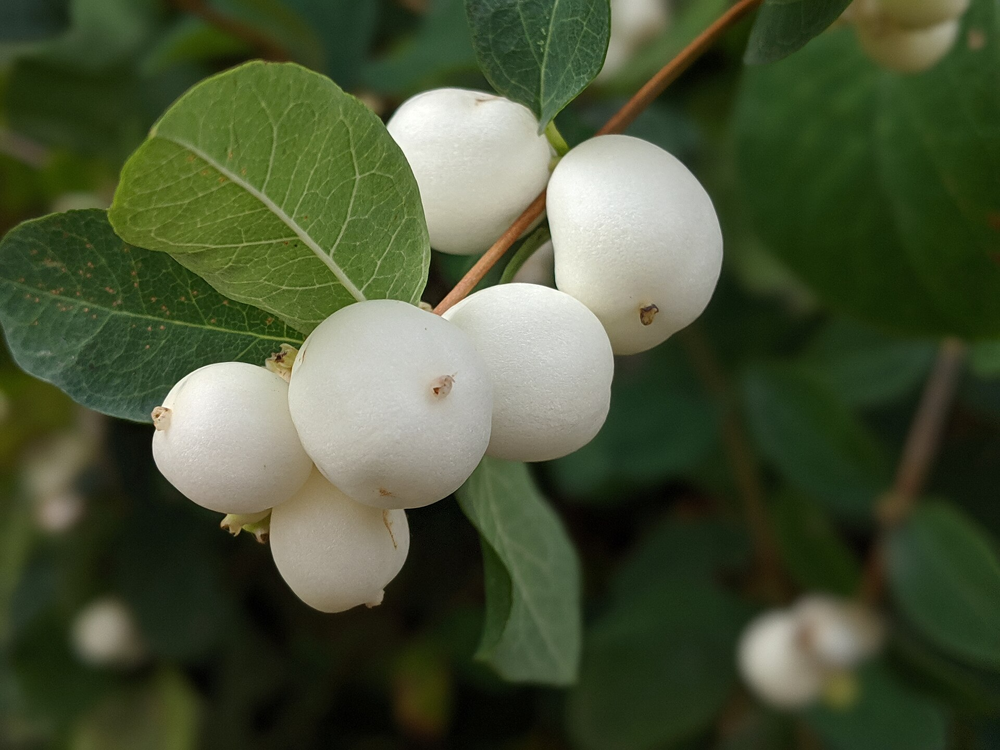

# Snowberry

CLI tool for inspecting [MASP](https://github.com/0xPolygonMiden/miden-base) package files across multiple `miden-mast-package` versions (0.13–0.22).

## Usage

```bash
snowberry <file.masp>
snowberry <file.masp> --verbose
```

## Supported versions

| Format version | `miden-mast-package` |
|----------------|----------------------|
| `[0, 0, 0]`    | 0.13                 |
| `[1, 0, 0]`    | 0.17                 |
| `[2, 0, 0]`    | 0.18                 |
| `[3, 0, 0]`    | 0.20                 |
| `[4, 0, 0]`    | 0.22                 |

## Output:
```shell
$~ snowberry /path/to/package.masp

┌──────────────┬────────────────────────────────────────────────────────────────────────────────┐
│ name         │ miden_faucet_mint_tx                                                           │
├──────────────┼────────────────────────────────────────────────────────────────────────────────┤
│ version      │ 0.0.0                                                                          │
├──────────────┼────────────────────────────────────────────────────────────────────────────────┤
│ description  │ none                                                                           │
├──────────────┼────────────────────────────────────────────────────────────────────────────────┤
│ kind         │ executable                                                                     │
├──────────────┼────────────────────────────────────────────────────────────────────────────────┤
│ digest       │ Word([6176557f7dcfc63d, 90c53cb3fba61482, a8f5d9b132aa38ea, b63d0e8e9d0e000d]) │
├──────────────┼────────────────────────────────────────────────────────────────────────────────┤
│ exports      │ 1                                                                              │
├──────────────┼────────────────────────────────────────────────────────────────────────────────┤
│ dependencies │ 2                                                                              │
├──────────────┼────────────────────────────────────────────────────────────────────────────────┤
│ sections     │                                                                                │
└──────────────┴────────────────────────────────────────────────────────────────────────────────┘
```

## Etymology
The [snowberry](https://en.wikipedia.org/wiki/Symphoricarpos) belongs to the [Caprifoliaceae](https://en.wikipedia.org/wiki/Caprifoliaceae) family of plants, alongside the [teasel](https://en.wikipedia.org/wiki/Dipsacus).

Despite being a contrived simile, one can think of the [snowberry](https://en.wikipedia.org/wiki/Symphoricarpos)'s fruit as its *package*.


